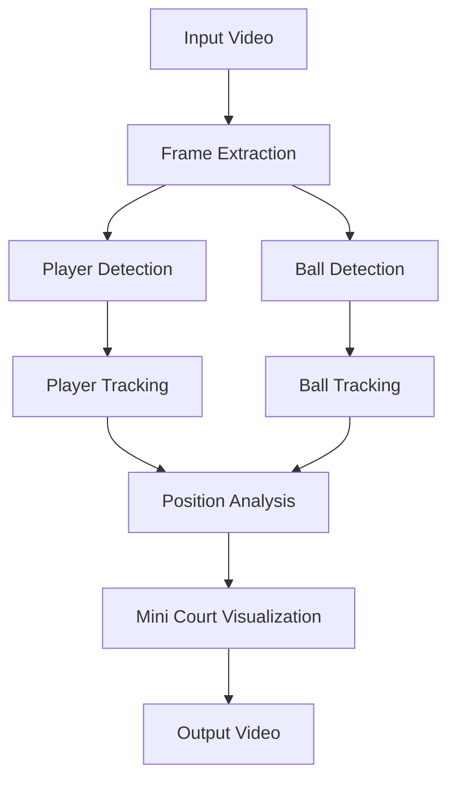

# Tennis Video Analysis System 🎾

A sophisticated computer vision system for analyzing tennis matches using deep learning. The system tracks players, detects the tennis ball, and provides a real-time tactical view of the game.

## Demo

### Input Video
<video src="https://github.com/KairavDeepeshwar/Tennis-Video-Analyst/raw/main/demo_videos/input_video.mp4" controls="controls" style="max-width: 730px;">
</video>

### Output Video with Analysis
<video src="https://github.com/KairavDeepeshwar/Tennis-Video-Analyst/raw/main/demo_videos/output_video_interpolation.mp4" controls="controls" style="max-width: 730px;">
</video>

## Features

- 🏃‍♂️ Real-time player tracking and identification
- 🎾 Tennis ball detection and trajectory analysis
- 🎯 2D tactical court visualization
- 📊 Position mapping and analysis
- 🔄 Multi-frame tracking persistence
- 📐 Scale-accurate court representation

## System Architecture



## Components

### 1. Player Tracking
- YOLOv8-based detection system
- Persistent ID tracking across frames
- Multi-player support

### 2. Ball Detection
- Specialized tennis ball detector
- Trained on custom dataset
- High-precision tracking

### 3. Mini Court Visualization
- Real-time 2D tactical view
- Scale-accurate position mapping
- Player and ball position visualization

## Installation

1. Clone the repository:
```bash
git clone https://github.com/KairavDeepeshwar/Tennis-Video-Analysis.git
cd Tennis-Video-Analysis
```

2. Install dependencies:
```bash
pip install -r requirements.txt
```

3. Download pre-trained models:
```bash
# Models will be automatically downloaded when running the system
```

## Usage

1. Basic usage:
```python
python main.py
```

2. Custom video input:
```python
python main.py --input_video path/to/your/video.mp4
```

3. Advanced options:
```python
python main.py --input_video path/to/video.mp4 --output_path output/ --show_display True
```

## Project Structure

```
Tennis-Video-Analysis/
├── main.py                 # Main entry point
├── mini_court.py          # 2D court visualization
├── input_videos/          # Source videos
├── output_videos/         # Processed results
├── models/               # Model weights
├── trackers/             # Tracking implementations
├── utils/                # Utility functions
└── training/             # Training notebooks and data
```

## Model Training

The system uses custom-trained models:

1. Player Detection: YOLOv8 model trained on tennis match footage
2. Ball Detection: Specialized model trained on tennis ball dataset
3. Court Detection: Keypoint detection model for court analysis

## Requirements

- Python 3.8+
- PyTorch 1.8+
- OpenCV 4.5+
- Ultralytics YOLO
- NumPy
- Additional requirements in `requirements.txt`

## Performance

- Supports real-time processing on modern GPUs
- CPU fallback available with reduced performance
- Tested on videos up to 4K resolution

## Contributing

1. Fork the repository
2. Create your feature branch (`git checkout -b feature/AmazingFeature`)
3. Commit your changes (`git commit -m 'Add some AmazingFeature'`)
4. Push to the branch (`git push origin feature/AmazingFeature`)
5. Open a Pull Request

## License

This project is licensed under the MIT License - see the [LICENSE](LICENSE) file for details.

## Acknowledgments

- YOLOv8 team for the object detection framework
- OpenCV community for computer vision tools
- Tennis video dataset contributors

## Contact

Your Name - [@yourtwitter](https://twitter.com/yourtwitter)

Project Link: [https://github.com/yourusername/Tennis-Video-Analysis](https://github.com/yourusername/Tennis-Video-Analysis) 
